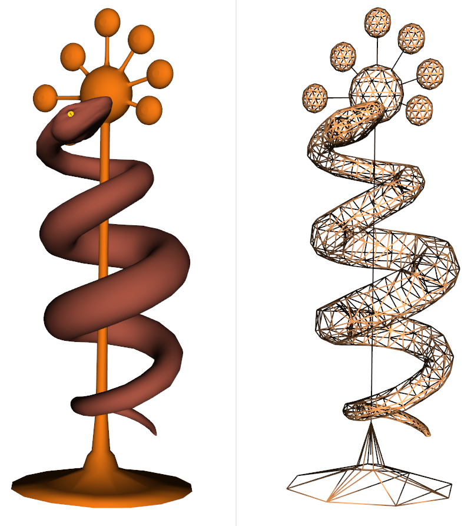
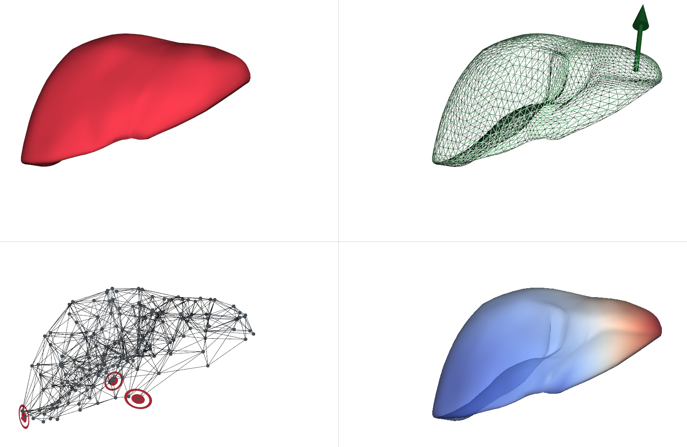

# SimulationSimpleDatabase (SSD)


The **SSD** project provides Python3 tools allowing users to easily develop **data storage** and **visualization** 
strategies for their **numerical simulations** with a minimal lines of code.

This project has two main objectives:
* Easy **storage** management system for **any data** from a numerical simulation;
* Easy **storage** & **rendering** management systems for **visual data** from a numerical simulation.

The **SSD** project is mainly using the [Peewee](http://docs.peewee-orm.com/en/latest/) Python3 library and was mostly 
designed to fit the [**DeepPhysX**](https://github.com/mimesis-inria/DeepPhysX) and 
[**SOFA**](https://www.sofa-framework.org/) frameworks.

Discover more about the project on the dedicated 
[**Documentation**](https://simulationsimpledatabase.readthedocs.io/en/latest/).

## Features

The **SSD** project provides the following `Core` packages:
* `SSD.Core.Storage`
  * Automatic management of Database file for any data;
  * Creation of highly customizable Tables in the Database;
  * Easy writing and reading user interface; 
  * Event management system;
  * Tools such as merging and exporting data in other formats.
* `SSD.Core.Rendering`
  * Automatic management of Database file for visualization data;
  * Live rendering of numerical simulations;
  * Replay of stored numerical simulation steps;
  * Various object types and highly customizable rendering styles;
  * Several Python libraries available: [Vedo](https://vedo.embl.es/), [Open3D](http://www.open3d.org/)

The **SSD** project also provides a `SOFA` compatible package with additional features:
* `SSD.SOFA.Storage`
  * Callbacks to automatically record any Data field of SOFA objects.
  * Recording can be done whether the simulation is running with *runSofa* or with a *python* interpreter.
* `SSD.SOFA.Rendering`
  * Callbacks to automatically record visual Data fields of SOFA objects.
  * Recording can be done whether the simulation is running with *runSofa* or with a *python* interpreter.
  * Rendering is available when a simulation is driven with a *python* interpreter.


## Install

### Install with pip

The **SSD** project is registered on [PyPi]('https://pypi.org/project/SimulationSimpleDatabase/), thus it can easily 
be installed using `pip`:

``` bash
$ pip3 install SimulationSimpleDatabase
```

### Install from sources

You can also easily install the **SSD** project from sources using the following instructions:

``` bash
$ git clone https://github.com/RobinEnjalbert/SimulationSimpleDatabase.git
$ cd SimpleSimulationDatabase

# Option 1: Install as non-editable (users)
$ pip3 install .

# Option 2: Install as editable (developers)
$ python3 setup_dev.py set
```


## Gallery

|      **examples/SOFA/rendering-offscreen/replay.py**      |
|:---------------------------------------------------------:|
|  |

|        **examples/SOFA/rendering/replay.py**        |
|:---------------------------------------------------:|
|  |