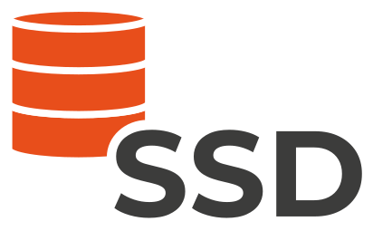

SSD - SimulationSimpleDatabase
==============================

The **SSD** project provides Python3 tools allowing users to easily develop **data storage** strategies for their
**numerical simulations**.

The **SSD** project has two main objectives:

  * **Storage**: Easy **storage** management system for **any data** coming from a numerical simulation.
  * **Rendering**: Easy **storage** and **rendering** management systems for **visual data** from a numerical simulation.

The **SSD** project is mainly using the :Peewee:`Peewee <>` Python3 library and was mostly designed to fit the
:DeepPhysX:`DeepPhysX <>` and :SOFA:`SOFA <>` frameworks.

Features
--------

.. container:: twocol

    The **SSD** project provides the following packages:

    .. container:: leftside

        ``SSD.Generic.Storage``
         * Automatic management of Database file;
         * Creation of highly customizable Tables in the Database;
         * Easy writing and reading interface;
         * Signal management system;
         * Utils such as merging and exporting in other formats.

    .. container:: rightside

        ``SSD.Generic.Rendering``
         * Automatic management of Database file for visualization data;
         * On-line rendering of numerical simulations;
         * Replay of stored simulation steps;
         * Various object types;
         * Several Python libraries available: :Vedo:`Vedo <>`.

.. container:: twocol

    The **SSD** project also provides a compatible layer with :SOFA:`SOFA <>` framework:

    .. container:: leftside

        ``SSD.SOFA.Storage``
         * Same features as Generic Storage package;
         * Compatible layer with :SOFA:`SOFA <>` Python bindings.

    .. container:: rightside

        ``SSD.SOFA.Rendering``
         * Same features as Generic Rendering package;
         * Compatible layer with :SOFA:`SOFA <>` Python bindings.

.. toctree::
    :caption: PRESENTATION
    :maxdepth: 1
    :hidden:

    Install   <Presentation/install.rst>
    Overview  <Presentation/overview.rst>

.. toctree::
    :caption: STORAGE
    :maxdepth: 1
    :hidden:

    Database             <Generic/Storage/database.rst>
    Table Relationships  <Generic/Storage/relationships.rst>
    Utils                <Generic/Storage/utils.rst>
    API                  <Generic/Storage/api.rst>

.. toctree::
    :caption: RENDERING
    :maxdepth: 1
    :hidden:

.. toctree::
    :caption: SOFA
    :maxdepth: 1
    :hidden:
