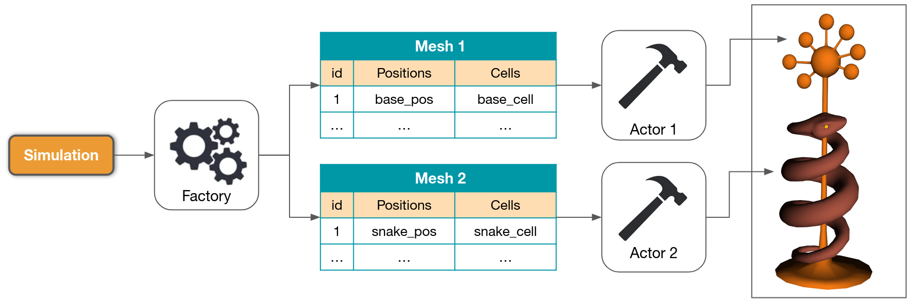

Definitions
===========

Storage
-------

The data storage model is designed with the following concepts:

 * a file with the `.db` extension contains a single *Database*;
 * a *Database* contains several *Tables*;
 * each *Table* contains several *Fields* (columns of the *Table*);
 * each row of the *Table* contains data.

.. figure:: ../_static/images/overview_storage.png
    :alt: overview_storage.png
    :align: center
    :width: 85%

The *Database* can contain two types of *Tables*:

    .. list-table::
        :widths: 15 50
        :class: tight-table

        * - ``StoringTable``
          - This type of *Table* is designed to store a great amount of data.

        * - ``ExchangeTable``
          - This type of *Table* is designed to exchange a few rows of data between the components
            that are using the *Database* and that require a signal handling system.

In both cases, the creation of Tables is highly customizable, since user can dynamically add a new *Field* to a *Table*
by specifying its name, type and default value.
Both *Table* types also share a common API to write, read and update entries.

Rendering
---------

The rendering part of the project involves the same concept than the storage part applied to visualization data.
Other concepts are dedicated to the rendering part itself:

 * a *Factory* is the user API that allows to easily add objects (such as meshes, point-clouds, etc) to the rendering
   window;
 * visualization data are formatted and sent to a dedicated Database by this *Factory*; each object will have a
   dedicated *Table* in the *Database*;
 * an *Actor* is the object API that create and update visual object instances;
 * a *Visualizer* is finally the rendering window manager.

